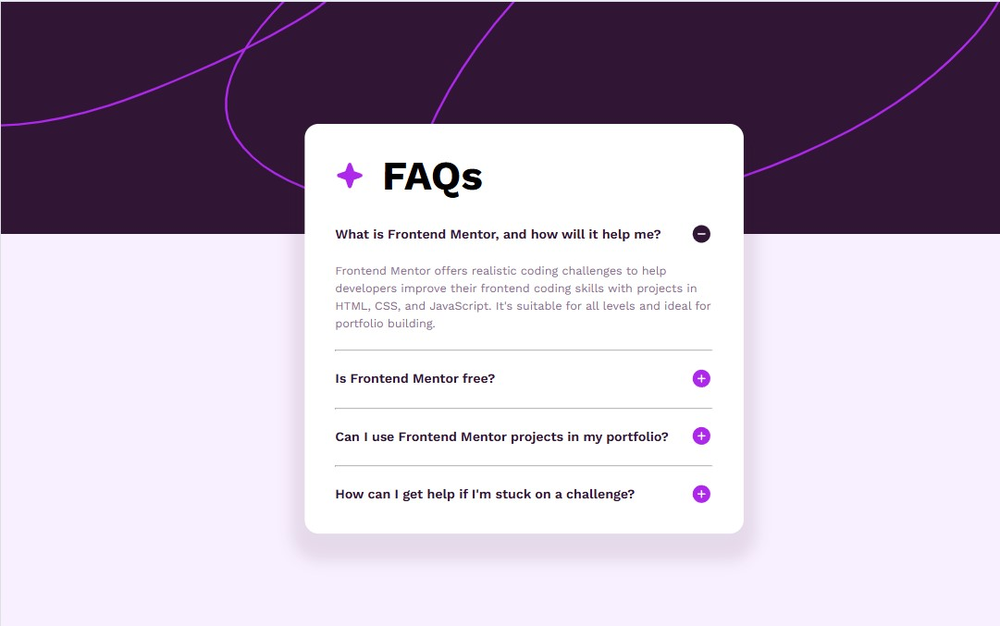
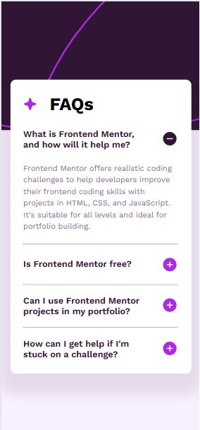

# Frontend Mentor - FAQ accordion solution

This is a solution to the [FAQ accordion challenge on Frontend Mentor](https://www.frontendmentor.io/challenges/faq-accordion-wyfFdeBwBz). Frontend Mentor challenges help you improve your coding skills by building realistic projects. 

## Table of contents

- [Overview](#overview)
  - [The challenge](#the-challenge)
  - [Screenshot](#screenshot)
  - [Links](#links)
- [My process](#my-process)
  - [Built with](#built-with)
  - [What I learned](#what-i-learned)
  - [Useful resources](#useful-resources)
- [Author](#author)

**Note: Delete this note and update the table of contents based on what sections you keep.**

## Overview

### The challenge

Users should be able to:

- Hide/Show the answer to a question when the question is clicked
- Navigate the questions and hide/show answers using keyboard navigation alone
- View the optimal layout for the interface depending on their device's screen size
- See hover and focus states for all interactive elements on the page

### Screenshot

### Links

- Solution URL: [solution URL](https://github.com/AnthonyCampana/faq-accordion-main)
- Live Site URL: [live site URL](https://anthonycampana.github.io/faq-accordion-main/)

## My process

### Built with

- Semantic HTML5 markup
- CSS custom properties
- Flexbox
- Mobile-first workflow

### What I learned

what I learned through this project was how to utilize javascript to modify elements on the DOM.

### Useful resources

- [mozilla documentation](https://developer.mozilla.org/en-US/) - This helped me understand what properties I needed to add to my html tags.

## Author

- Website - [Anthony Campana](https://anthonycampana.pythonanywhere.com/)
- Frontend Mentor - [@AnthonyCampana](https://www.frontendmentor.io/profile/AnthonyCampana/solutions)

